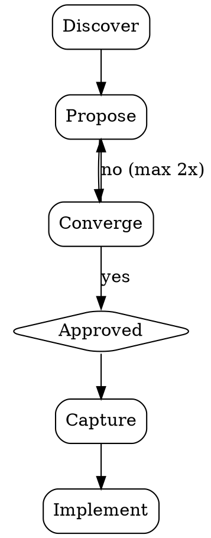

# Simple (lightweight brainstorming)

A structured, lightweight flow to move from an idea to an agreed direction before building. It keeps enough rigor to compare options and surface constraints, without heavy ceremony.

The goal is straightforward: understand what is needed, weigh two approaches with trade-offs, get explicit approval, then implement.

## Ground rules

Do **not** write code, scaffold files, or take implementation steps until the user has **explicitly approved** a direction. This applies even when the task looks obvious. The point is to align before building.

## Process

- **Discover** — Use project context (codebase layout, conventions, existing patterns). Ask up to **three** focused questions at once, preferably with multiple-choice where helpful, to clarify intent, constraints, and success criteria. If the request is already unambiguous, skip to Propose.

- **Propose** — Offer **two** approaches with clear trade-offs. State a **recommendation** and why. Keep each option to a short paragraph; scale depth to complexity.

- **Converge** — Obtain **explicit** user approval. If rejected, revise and repropose (at most **two** extra rounds). If still misaligned, ask the user to state the desired direction directly. A good-enough decision now beats a perfect one later.

- **Capture** — Record the chosen direction (what, why, key decisions) as a brief inline comment in the first file you create, or summarize it in chat. No separate design document unless the user asks for one.

## Principles

- **Speed over ceremony** — Value is in the thinking, not the paperwork.

- **YAGNI** — Design for today’s requirements; avoid speculative abstraction.

- **Bias toward action** — When options are close, pick one and validate by building.

- **Batched discovery** — Ask clarifying questions together, not one message at a time.

- **Proportional depth** — Match process weight to task weight (small fixes may compress several steps into one reply).
